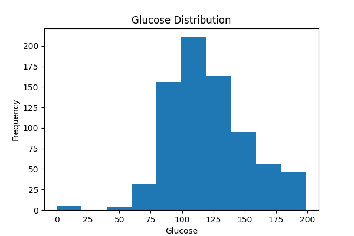
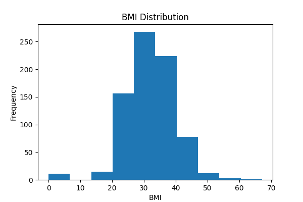
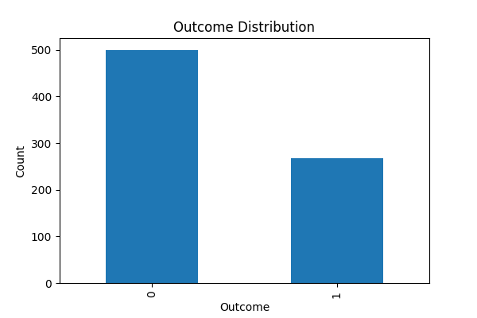
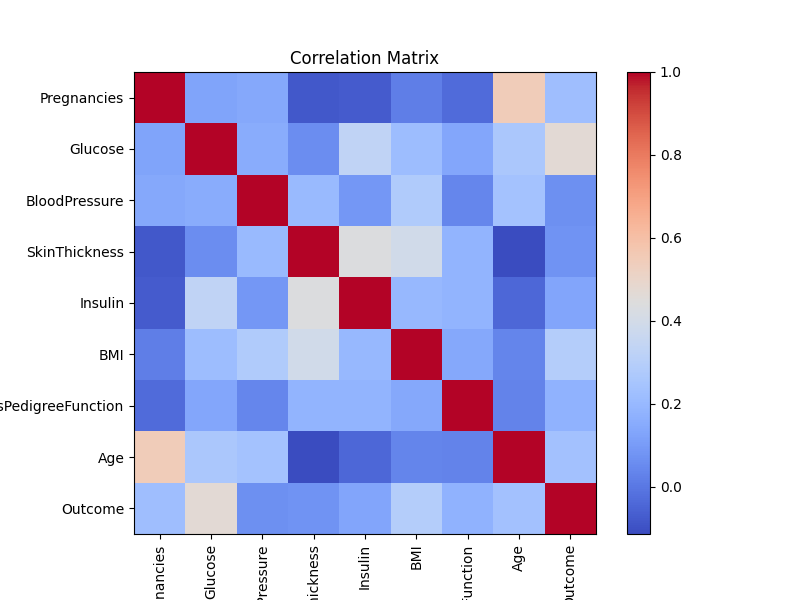

# Biomedical EDA: Diabetes Analysis

## Project Objective

## Dataset Information

## Tools Used
- Python
- Pandas
- NumPy
- Matplotlib

## Key Findings
- Glucose showed the strongest correlation with diabetes.
- Diabetic patients had higher BMI.
- Age was positively associated with diabetes.
- Insulin contained many missing values.

## Sample Visualizations

## Sample Visualizations

### Glucose Distribution

### BMI Distribution

### Outcome Distribution

### Correlation Matrix

## Repository Structure

DATA/
NOTEBOOKS/
OUTPUTS/
REPORTS/

## Future Improvements
- Machine Learning prediction model
- Power BI dashboard
- Statistical hypothesis testing
